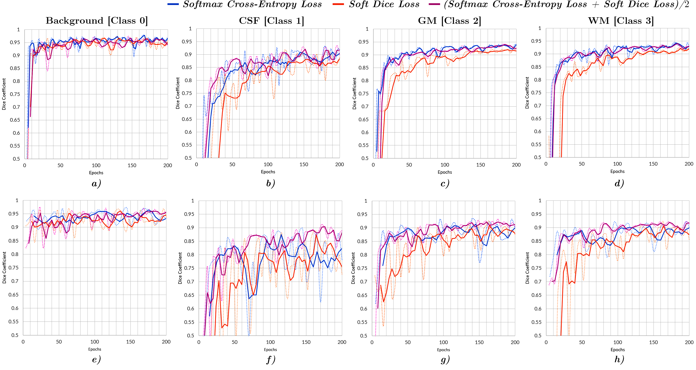
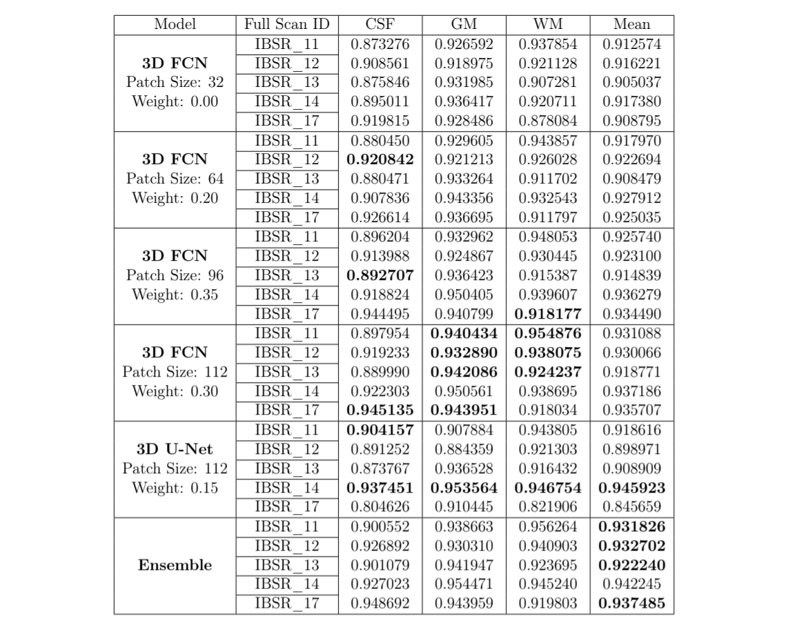

# Ensemble of Convolutional Neural Networks for 3D Multi-Class Brain Segmentation in T1 MRI

**Problem Statement**: Fully supervised, multi-class 3D brain segmentation in T1 MRI. 

**Note**: The following approach won **1st place place in the 2019 Medical Image Segmentation and Applications: Brain Tissue Segmentation Challenge** at [Universitat de Girona](https://www.udg.edu) scoring **Dice Coefficient: 0.932 [CSF: 0.906, GM: 0.947, WM: 0.945] and Hausdorff Distance (mm): 10.306 [CSF: 15.909, GM: 7.620, WM: 7.387] at test-time**, during the 2018-20 Joint Master of Science in [Medical Imaging and Applications (MaIA)](https://maiamaster.udg.edu) program.  

**Acknowledgments**: DLTK for the TensorFlow.Estimator implementation of [3D U-Net, 3D FCN and DeepMedic](https://github.com/DLTK/models) model architectures and NiftyNet for the  TensorFlow implementation of [Cross-Entropy and Dice Loss](https://github.com/NifTK/NiftyNet/blob/dev/niftynet/layer/loss_segmentation.py).
 
**Data**: *Label 0*: Background; *Label 1*: Cerebrospinal Fluid (CSF); *Label 2:* Gray Matter (GM); *Label 3:* White Matter (GM) [10/5/3 : Train/Val/Test Ratio]
 
 
**Directories**  
  ● Resample NIfTI Volume Resolutions: `scripts/preprocess.py`  
  ● Generate Data-Directory Feeder List: `scripts/feed_io.py`  
  ● Train Residual 3D FCN: `scripts/resfcn_train-val.py`  
  ● Train Residual 3D U-Net: `scripts/resunet_train-val.py`  
  ● Train DeepMedic: `scripts/deepmedic_train-val.py` *(Discontinued)*  
  ● Deploy Ensemble Model (Validation/Testing): `scripts/deploy_e.py` 

  
## Dataset  

*Table 1. Spatial resolution (in mm cube) across the full dataset —subset of the* [2018 Internet Brain Segmentation Repository (IBSR) Challenge](https://www.nitrc.org/projects/ibsr) 

   
     
## Patch Extraction/Multi-Scale Input  

*Figure 1.  [left-to-right] 32, 64, 96, 112 cube patches (resized to the same scale for display), each
offering a different receptive field and degree of contextual information to its subsequent CNN.* 

    
## Loss Function 

*Figure 2.  Training (a-d) and validation (e-h) moving-average curves monitoring the Dice
Coefficient of predictions for a residual 3D U-Net model with different loss functions, but otherwise identical hyperparameters (patch size 64 cube, mini-batch size 8, cyclic learning rate between 5e-05−2.5e-04). While soft dice loss alone demonstrates the weakest performance, when combined with softmax cross-entropy, it matches and outperforms the latter alone (particularly for CSF).*  
 

## Effect of Preprocessing 

*Table 2.  : Performance (in Dice Coefficient) on validation subset using a residual 3D FCN model with/without preprocessed data, but otherwise identical loss functions and hyperparameters (patch size 64 cube, mini-batch size 8, cyclic learning rate between 5e-05−2.5e-04).*
 

## Model Performance  

*Table 3.  Performance (in Dice Coefficient) on validation subset using candidate CNNs and their collective ensemble, with varying input patch sizes, training schemes and hyperparameters. The highest Dice Coefficient achieved for each class of a given scan among member models, are marked in bold. Additionally, the best mean Dice Coefficient for each scan are marked in bold.*

